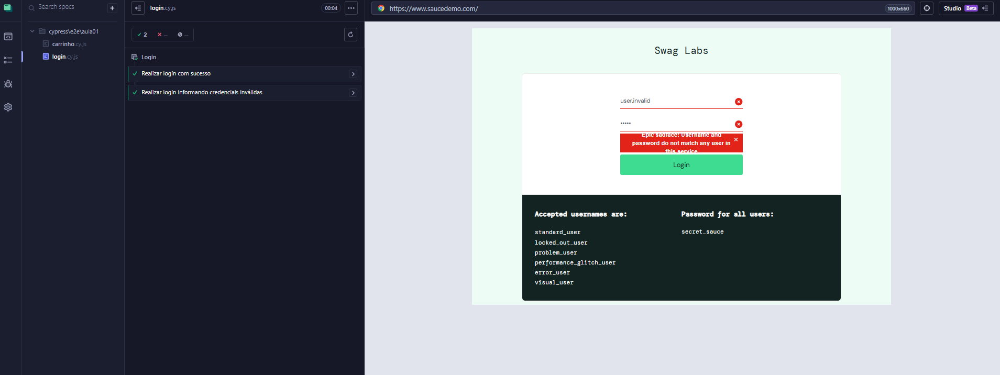

# Cypress SauceDemo – Testes Automatizados E2E

Projeto de automação de testes end-to-end com **Cypress** e **JavaScript**, aplicado ao site de prática [SauceDemo](https://www.saucedemo.com/).

> Projeto de estudo e portfólio, desenvolvido por **Elisa Venica** como parte da transição para a área de QA.

## Objetivo

Praticar automação de testes web, cobrindo fluxos reais de um e-commerce: login e carrinho de compras.

## Tecnologias

- [Cypress](https://www.cypress.io/)
- JavaScript (ES6)
- Node.js e npm
- Git e GitHub

## O que é testado

| Funcionalidade | Cenários |
|---|---|
| Login | Login com sucesso, login com senha inválida, usuário bloqueado |
| Carrinho | Adicionar produto, remover produto, conferir itens no carrinho |

> Ajuste a tabela conforme os testes que você realmente tem.

## Estrutura do projeto

```
cypress/
├── e2e/
│   └── aula01/        # testes de login e carrinho
├── fixtures/          # dados de teste
├── pages/             # Page Objects
├── reports/           # relatórios de execução
└── support/           # comandos customizados e configurações
config-dev.js          # configuração do ambiente de desenvolvimento
config-qa.js           # configuração do ambiente de QA
cypress.config.js      # configuração principal do Cypress
```

## Como executar

**Pré-requisitos:** Node.js (versão LTS), Git e VS Code.

```bash
# 1. Clonar o repositório
git clone https://github.com/Elisavenica/cypress-saucedemo.git

# 2. Entrar na pasta
cd cypress-saucedemo

# 3. Instalar as dependências
npm install

# 4. Abrir o Cypress com interface
npx cypress open

# ou rodar todos os testes no terminal
npx cypress run
```

## Boas práticas aplicadas

- Testes independentes entre si
- Seletores estáveis (`data-test`, `id`) em vez de classes geradas automaticamente
- Dados de teste separados em `fixtures`
- Organização com Page Objects (pasta `pages`)
- Ambientes configuráveis (dev e qa)

## Evidências

### Login


## Próximos passos

- [ ] Integração contínua com GitHub Actions
- [ ] Testes de API com `cy.request`
- [ ] Cenários em BDD (Cucumber/Gherkin)
- [ ] Relatório de testes mais detalhado

## Autora

**Elisa Venica**
GitHub: [@Elisavenica](https://github.com/Elisavenica)
LinkedIn: (https://www.linkedin.com/in/elisa-vênica-b6a6b5164 )
